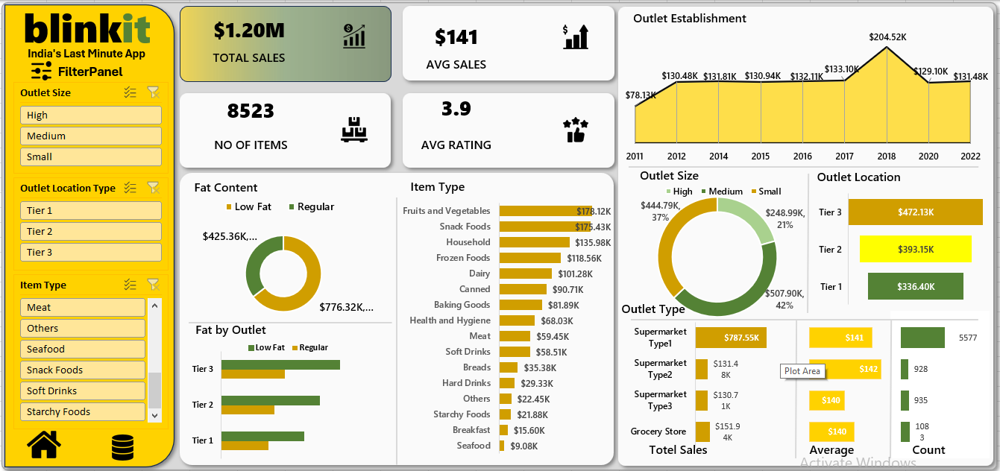

# 📊 Blinkit Sales Analysis Dashboard (Excel)

## 📌 Project Overview
The Blinkit Sales Analysis Dashboard is an interactive Microsoft Excel project designed to analyze retail sales performance and generate meaningful business insights. This dashboard transforms raw sales data into visual insights to support data-driven decision making.

---

## 🎯 Project Objectives
- Analyze overall sales performance
- Identify top-performing product categories
- Evaluate outlet performance by size and location
- Understand the impact of product fat content on sales
- Monitor key performance indicators (KPIs)

---

## 📊 Key Performance Indicators (KPIs)

| Metric | Value |
|------|------|
| Total Sales | $1.20M |
| Average Sales | $141 |
| Number of Items | 8,523 |
| Average Rating | 3.9 |

---

## 📈 Dashboard Insights
- Tier 3 outlets generate the highest sales compared to Tier 1 and Tier 2.
- Medium-sized outlets contribute the largest share of revenue.
- Regular fat content products sell more than low-fat products.
- Supermarket Type 1 produces the highest total sales.
- Fruits & Vegetables and Snack Foods are the top-selling categories.

---

## 🛠 Tools & Skills Used
- Microsoft Excel
- Pivot Tables
- Pivot Charts
- Slicers
- Data Cleaning
- Data Visualization
- Dashboard Design

---

## 🎛 Dashboard Features
- Interactive filters for **Outlet Size, Outlet Location Type, and Item Type**
- KPI cards displaying key business metrics
- Sales distribution by outlet size and location
- Product category performance analysis
- Fat content comparison
- Outlet establishment trend analysis

---

## 📷 Dashboard Preview

---
